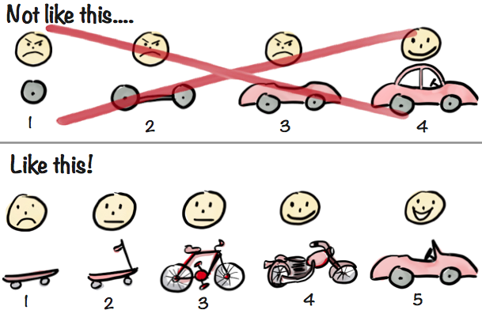
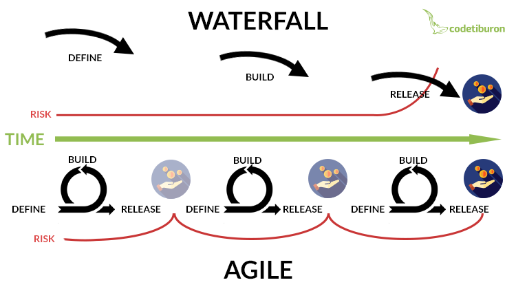

# Deadlines vs. Continuous Delivery

Given that we have only partially studied the R programming language, it would be unfair to expect a perfectly working finished product by the "deadline" of Tuesday, September 17. However, in software development, products are improved in increments, beginning with the simplest working prototype (called a Minimum Viable Product - MVP), rather than have the customer wait for a long time to get the finished version. 

Notice in the figure above, the finished product is different because the engineers were able to get feedback from the customer who was using the intermediate products. 
This is in contrast to the traditional product engineering workflow that you might be more familiar with, called the "waterfall" approach. In this framework, engineering designs flow downward from the initial definition. In contrast, in the "Agile" approach, there is a sequence of incremental improvements on a working product that the customer can use. 

While the waterfall approach is suitable and necessary for some very large products, software is typically developed with the Agile approach in mind. 

