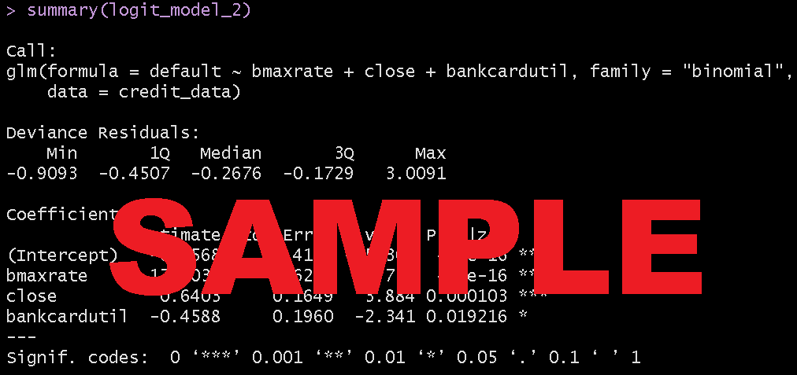

# Sample of Responses to Assignment 3

In GitHub, any file called ```README.md``` is a markdown file that automatically rendered into the documant you see here.
Open this file in any text editor to see how the script is entered. 
Search for "git markdown cheat sheet" for links with descriptions of the commands to display your content. 

# Assignment 3

## Question 1

a) This is my answer to part (a). 

b) This is my answer to part (b). 



c) This is my answer to part (c). 

d) This is my answer to part (d). 


e) This is my answer to part (e). 


