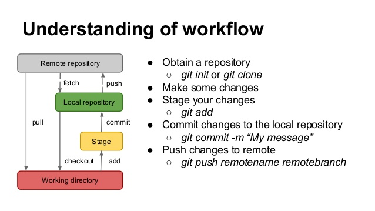
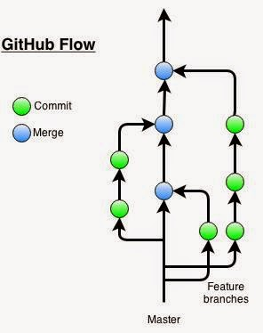

# Version Control

The practice of saving successive versions of computer code is known as version control. With this practice, you can securely store past and present versions of your code on a remote computer and share it with others.
The version control platform that we will use is called GitHub and the reason for this choice is outlined in Paarsch and Golyaev.

## GitHub Workflow



## Version Control 1: Through a Web Browser

This exercise can be completed on any device that has access to the internet - including your smartphone.

### Open an account

Follow the instructions in [Signing up for a new GitHub account](https://help.github.com/en/articles/signing-up-for-a-new-github-account).

### Start a new coding project

If you want to create a new coding project, you should begin by creating a new repository. A repository is a location in your user space that can be used to store youre code. To initialize a new repository (or repo, for short), follow the instructions in [Create a repo](https://help.github.com/en/articles/create-a-repo).

### Modify an existing project

Several versions of your code can be stored at the same time in units called branches.
The default storage space for a repository is called the master branch. Often, you will not want to make edits to the master branch when you are developing new code, so you would [create another branch of the repository](https://help.github.com/en/articles/creating-and-deleting-branches-within-your-repository).
Once you have tested your code, it can be pulled to the master branch by [Creating a pull request](https://help.github.com/en/articles/creating-a-pull-request).

### Forking: Making your own copy of the repo

For extensive edits, or to create a new, separate project built off an exisiting repository, you may want to [fork an existing repo](https://help.github.com/en/articles/fork-a-repo).

### Synching your fork

If other software engineers have editied the original repository, you will want to update those changes to the version in your repository. This is called synching your fork. Some links to help with this are found in [Syncing a fork](https://help.github.com/en/articles/syncing-a-fork) and a concise version is found [here](https://gist.github.com/CristinaSolana/1885435). Notice, that this advice is stated in terms of the relevant commands through a terminal, instead of a point-and-click interface.
With this approach, GitHub is a much more versatile tool.

## Working in Parallel in Separate Branches



## Version Control 2: Using the terminal


To participate in this exercise, you should have installed [Git](https://git-scm.com/) and an associated terminal GitBash.


### Using GitHub for Version Control

If your code is not yet associated with a repository, then your code base is untracked. To track your software, either initialize a new repo or clone an existing repo and add your code to it. We will follow the second approach today, as you will use it to download the code base for the course and modify it as you need. As for initializing your own repo, we will progress to that stage as you begin to work on your own coding projects.

Open a unix terminal and navigate to a directory in which you want to work (```cd path/to/your/preferred/workspace```).

Clone the repo to your workspace:
```
git clone https://github.com/LeeMorinUCF/ECO5445F18
```

To be nice to the repo owner, you should start your own branch of the repo, on which you can make your own changes.
```
git branch your_new_branch_name
```
Then move into that branch:
```
git checkout your_new_branch_name
```

Then make changes to files and add files to your own local copy.

When you want to add changes to the local branch, ```add``` the files:
```
git add .
```

When you want to commit those changes to your local repo, you can enter
```
git commit -m 'Description of the changes you made goes here'
```

Finally, if you have the permissions to do so, you can push your changes to the remote repository:
```
git push origin your_new_branch_name
```
You may be asked for login credentials, which will be the credentials for your GitHub profile.

If all goes well, you can refresh the repo in the browser, change the branch tab to ```your_new_branch_name``` and you should see your changes to the repo. These modifications are now part of the remote repository and are safely stored regardless of what happens to your local computer. Moreover, your teammates on a coding project can view your changes and work them into a larger coding project.

A helpful tip is to get accustomed to using the ```git status``` command. This will tell you the current status of the changes that you have made. You can use it between the ```git add```, ```git commit``` and ```git push``` commands above to see how the changes progress.


## Privacy Settings

### Making a Repo Private

In a business setting, there may be sensitive information for which a select group has access.
A repo and all of its forks can be made private, so that only the collaborators can gain access.
However, the privacy setting places the same restriction for all collaborators and all forks, meaning that any collaborator can see the contributions made in every fork, and all forks must have the same privacy setting as the upstream repo.
Often this setting is sufficient and the procedure for enacting this setting is as follows.

1. In a browser, browse to your git user page, sign in and click the 'Settings' tab.

2. Highlight 'Options' and scroll all the way to the bottom (yes, all the way into the 'Danger Zone') and click the button 'Make Private' in the section 'Make this repository private'.

3. Enter the repo name to make it official.
This is in the 'Danger Zone' because this could block access to someone who depends on this information, interrupting their workflow. In our case, it allows you to keep your work private.

4. After this change, other collaborators cannot see your work, so you will have to invite them as collaborators. Scroll to the bottom, enter their username, such as LeeMorinUCF, and click 'Add collaborator'. The collaborator will be notified and will be sent a link to activate their status.

### Making a Private Mirror of a Public Repo

In order to have separate access restrictions to a copy of the repo, a simple solution is to create a new repository that mirrors the content of the original. 
You might use this mirror the same way you would use a fork, except that it is no different than any other repository. 

A command line version of this procedure is available here: [GitHub: How to make a fork of a public repository private?](https://medium.com/@bilalbayasut/github-how-to-make-a-fork-of-public-repository-private-6ee8cacaf9d3)

In essence, this amounts to creating a separate repository that happens to contain the same information as the original. 

Since this is a one-time occurrence, this can be done in your web browser from your GitHub user page. 

1. Under the Repositories tab, click the green New button. 
2. In the next screen, choose a name for your new repo. 
3. Before clicking the green Create Repository button, set this new repo to Private. 
4. After clicking the Create Repository button, you will move to a screen to add content to the new repo. 
5. Since you are creating a mirror, scroll to the bottom and choose the Import Code button and enter the url for the original repo that you want to clone. 
6. If you have access to this repo, it will initialize the content to your new repo. 
7. This repo is ready to be cloned to your local machine. Use the ```git clone``` command as usual.
8. In order to pull any new content to the original repo, this original repo will have to be set as the upstream repo. 
After cloning the new repo to your local machine, enter a command like the following

```
git remote add upstream https://github.com/UpstreamGitUserName/UpstreamRepoName.git
```
where you would get the url in the same way you would to clone the original upstream repo. 

9. Now you can pull new content from the upstream to your local machine. 

```
git pull upstream master
```
where the pull is from the master branch of the upstream repo and not the orign. 

10. Now these updates are on your local machine but have not been pushed to your mirror of the repo. 

```
git push origin master
```
will work the same as for any other content you add, except these are already added and committed to the upstream repo. 


## Getting Your Bearings

With all of the repositories, branches, forks and mirrors, it is easy to get lost. When working in a repo, one can find the url for the origin of your clone by entering the following.

```
git remote get-url origin
```

While this command does not work on all platforms, the following provides more verbose output.

```
git remote show origin
```

Notice that the output will show the url of the repo from which new content is fetched, the url to which your updates are pushed, along with a lising of the branches of the repo.

For forked repos, the above commands can be modified with ```origin``` swapped for ```upstream``` to show the references for the upstream repo from which this repo was forked.


## Summary: The Commands Used Most Often

### Updates to the Upstream Repo 

For example, when your instructor adds new content, pull those changes to your local machine and push them to your mirror of the repo:

```
git pull upstream master
git push origin master
```

### Updates to Your Local Copy

When you are working on your own coding project, add commit and push those changes to your repo:

```
git add .
git commit -m 'Describe changes here'
git push origin master
```

This command will not work if your local copy is not up to date. 

### Updates from Another Clone of Your Repo

This command is used when you want to pull any changes from other contributors (such as group members on a team project) or when you change devices. In both of these cases, your current device will not have the most recent copy. 

```
git pull origin master
```

As mentioned above, if you want to push updates and your version is not current, you will have to pull the recent changes before you can push your updates to the repo. 


